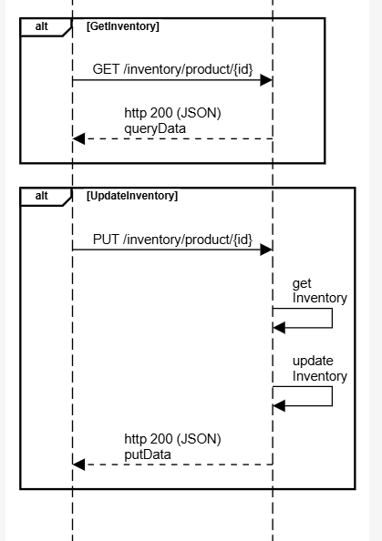

## Go-inventory

   This is workload for POC purpose such as load stress test, gitaction, etc.

   The main purpose is create 2 entities, Product and its Inventory.

   To local test you should use the work space:
   
   Create a work space (root)
   
    go work init ./cmd ../go-core

   Add module (inside /cmd)
   
    go work use ..

## Sequence Diagram

    
    
    title inventory

    participant user
    participant inventory

    entryspacing 1.1
    alt addProduct
        user->inventory:POST /product
        postData
    inventory->inventory:create\nproduct
    inventory->inventory:create\ninventory
        user<--inventory:http 200 (JSON)\npostData
        queryData
    end
    alt getProduct
    user->inventory:GET /product/{id}
    user<--inventory:http 200 (JSON)\nqueryData
    end
    alt GetProductId
    user->inventory:GET /productId/{id}
    user<--inventory:http 200 (JSON)\nqueryData
    end

    alt GetInventory
    user->inventory:GET /inventory/product/{id}
    user<--inventory:http 200 (JSON)\nqueryData
    end
    alt UpdateInventory
    user->inventory:PUT /inventory/product/{id}
    inventory->inventory:get\nInventory
    inventory->inventory:update\nInventory
    user<--inventory:http 200 (JSON)\nputData
    end

## Enviroment variables

To run in local machine for local tests creat a .env in /cmd folder

    VERSION=1.0
    ACCOUNT=aws:localhost
    APP_NAME=go-inventory.localhost
    PORT=7000
    ENV=dev

    DB_HOST= 127.0.0.1 
    #DB_HOST=rds-proxy-db-arch.proxy-couoacqalfwt.us-east-2.rds.amazonaws.com
    DB_PORT=5432
    DB_NAME=postgres
    DB_MAX_CONNECTION=30
    CTX_TIMEOUT=10

    LOG_LEVEL=info #info, error, warning
    OTEL_EXPORTER_OTLP_ENDPOINT = localhost:4317

    OTEL_METRICS=true
    OTEL_STDOUT_TRACER=false
    OTEL_TRACES=true

    OTEL_LOGS=true
    OTEL_STDOUT_LOG_GROUP=true
    LOG_GROUP=/mnt/c/Eliezer/log/go-inventory.log

## Endpoints

curl --location 'http://localhost:7000/health'

curl --location 'http://localhost:7000/live'

curl --location 'http://localhost:7000/header'

curl --location 'http://localhost:7000/context'

curl --location 'http://localhost:7000/info'

curl --location 'http://localhost:7000/metrics'

curl --location 'http://localhost:7000/product/soda-01'

curl --location 'http://localhost:7000/productId/4'

curl --location 'http://localhost:7000/inventory/product/soda-01'

curl --location 'http://localhost:7000/product' \
    --header 'Content-Type: application/json' \
    --data '{
        "sku": "mobile-101",
        "type": "eletrocnic",
        "name": "mobile 100",
        "status": "IN-STOCK"
    }'

curl --location --request PUT 'http://localhost:7000/inventory/product/floss-01' \
    --header 'Content-Type: application/json' \
    --data '{
        "available": 0,
        "pending": 0,
        "reserved": 1,
        "sold": 1
    }'

## Monitoring

Logs: JSON structured logging via zerolog

Metrics: Available through endpoint /metrics via otel/sdk/metric

Trace: The x-request-id is extract from header and is ingest into context, in order the x-request-id do not exist a new one is generated (uuid)

Errors: Structured error handling with custom error types

## Security

Security Headers: Is implement via go-core midleware

## Tables

    CREATE TABLE public.product (
        id 			BIGSERIAL 	NOT NULL,
        sku 		VARCHAR(100)	NOT NULL,
        type 		VARCHAR(100) NOT NULL,
        name 		VARCHAR(100) NOT NULL,
        status		VARCHAR(100) NOT NULL,
        created_at	timestamptz NOT NULL,
        updated_at	timestamptz NULL,
        CONSTRAINT 	product_pkey PRIMARY KEY (id)
    );

    CREATE UNIQUE INDEX product_sku_unique_idx ON public.product USING btree (sku);
    
    CREATE TABLE public.inventory (
        id 				BIGSERIAL	NOT NULL,
        fk_product_id	BIGSERIAL	NOT NULL,
        available		INT 		NOT null DEFAULT 0,
        pending 	 	INT 		NOT NULL DEFAULT 0,
        reserved	 	INT 		NOT NULL DEFAULT 0,
        sold		 	INT 		NOT null DEFAULT 0,
        created_at 		timestamptz 	NOT NULL,
        updated_at 		timestamptz 	NULL,   
        CONSTRAINT inventory_pkey PRIMARY KEY (id)
    );

    ALTER TABLE public.inventory ADD CONSTRAINT inventory_fk_product_id_fkey 
    FOREIGN KEY (fk_product_id) REFERENCES public.product(id);
